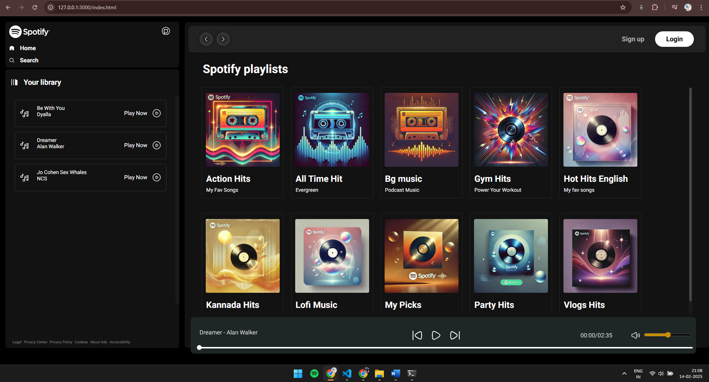

# Spotify Clone Project

Welcome to the Spotify Clone! This project aims to replicate a simple version of Spotify's music player using JavaScript, HTML, and CSS. Users can play, pause, and skip through songs in a playlist, view album artwork, and interact with a fully responsive music player. This project also allows for playlist management and song playback from local directories.

---

## Overview

This Spotify Clone is a dynamic music player that allows users to:

- Browse playlists
- Play, pause, and skip songs
- View song information (title and artist)
- Control the volume
- Navigate between songs with ease

The app fetches songs and playlists from a local server and dynamically updates the UI based on the data retrieved.

---


_Description: The home page where users can browse and play songs._

---

## Features

- **Music Playback**: Play, pause, and skip songs.
- **Playlist Navigation**: Browse through different playlists.
- **Dynamic Song Info**: Display song name, artist, and playback time.
- **Responsive Design**: Optimized for desktop, tablet, and mobile devices.
- **Seekbar**: Scrub through songs using a custom seekbar.
- **Volume Control**: Adjust the volume through the slider.

---

## Tech Stack

- **HTML**: Structure and layout of the music player.
- **CSS**: Styling to make the player look visually appealing and responsive.
- **JavaScript**: Handling logic for music playback, playlist navigation, and interactivity.

---

## Getting Started

To run this project locally, you'll need to have a server serving the music files and playlists. The app fetches data from a local server running on `http://127.0.0.1:3000/`.

Follow the steps below to set up and run the server.

---

## Running the Project

### Clone the Repository

```bash
git clone <repository-url>
cd <repository-name>
```
